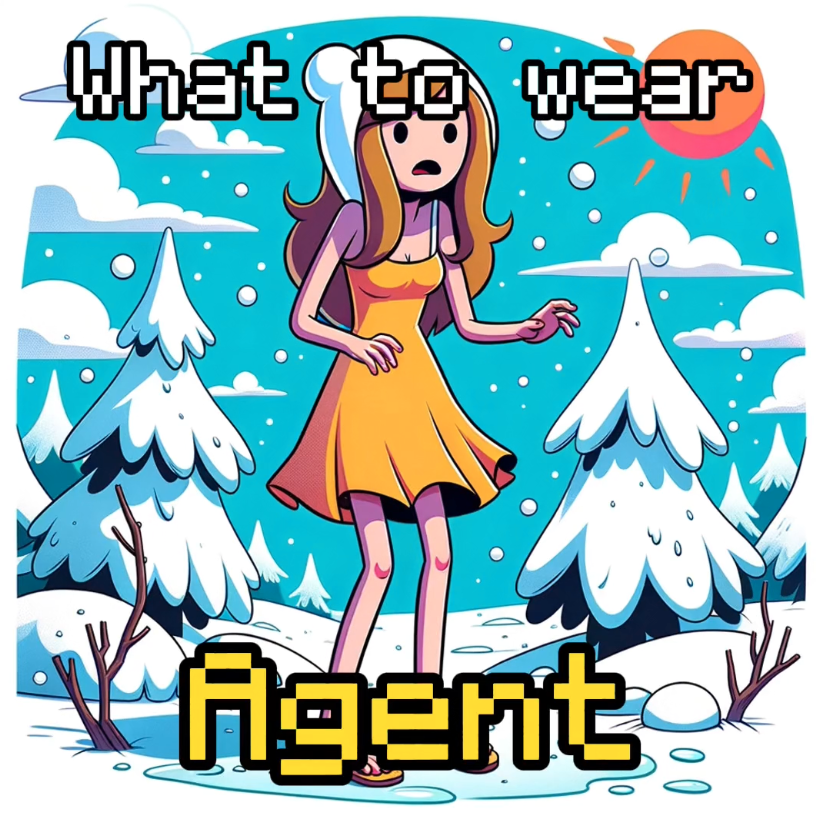

## Google AI Hackathon 2024 project - 'What to Wear' Agent

__Click the image to watch the demo.__

## Problem
**My girlfriend often doesn’t know how to dress properly for the weather**. She’s a supersmart and successful cybersecurity engineer, but sometimes, just struggles with appropriate clothing. When one of the major clothing misjudgements happened I asked:

>- _me: Why don’t you check the forecast before going out?_
>- _her: I used to, but these numbers and such tells me nothing._
>- _me: Hmm..._

About that time I stumbled upon the hackathon and thought that it may be cool to play a little with AI and help my girlfriend at the same time. **I was curious how common this problem is, did some research and discovered that she's definitely not alone**. Groups with similar experiences include:

- Children (and their parents)
- People with ADHD
- People with autism
- Some of my friends (that are adults and don't suffer from any disorders)
- People that moved from one climate to another 

And probably more, but maybe no one admits it publicly as it's a skill you usually learn as a kid. There's even an app with 10k+ downloads (and many positive reviews) that tries to help with the problem, but I believe I know how to do it a bit better.

**Summing up - although it sounds trivial initially, the problem with clothing for the weather seems to be more widespread than it seems and there’re people out there that I can help with my solution.**

## Solution
The app takes a user's location and returns a short recommendation what to wear to stay comfortable outside. **The recommendation is based on two data sources:**

- **Visual data from public cameras.** The app takes 3 pictures from cameras located in crowded places in a given location to capture what people that are already outside wear.
- **Current weather conditions and 12-hourly forecast.** It's highly detailed and includes data about e.g temperature, precipitation, wind speed, UV exposure.

This data is being passed to Gemini 1.5 that is prompted to analyze the data and return an actionable and reliable recommendation. **To improve the final results, I implemented [Self-Refine: Iterative Refinement with Self-Feedback algorithm](https://selfrefine.info/) so the model has more time to "think" and iterate in a feedback-refine loop.** Other prompting strategies include chain-of-thought reasoning, role/goal/task assignment and using few-shots examples. More details you will find in the code itself and in the app's architecture flowchart. 

The last part is to give the recommendation to the user. **The app can operate in two modes:**
- **Instant recommendation that is visible in a Streamlit app**. Just give your location and the app will return a well-formatted recommendation. Also, you can check what pictures it's based on _camera images page_ and see through a live camera lense. To discover "model's thinking" (based on ChatSession.history attribute and Self-Refine prompting) you can check _model thinking page_. Experimentally, the app also returns a visual recommendation - meaning it generates an image of a person dressed according to the main recommendation, but currently it's only sometimes accurate.
- **Daily recommendation that is being sent to user's email.** It's a convenient way of getting quality recommendations e.g every morning, but without access to camera images, thinking history or visual recommendation (edit: I found a bug only few hours before deadline and had to remove scheduling logic, but working on it).
The former is information richer, but takes time and requires intended action from the user (usually around 2-4 minutes), in the latter there's no waiting and thinking, but it's less flexible and informative. 
What I want to add - the app provides protection/comfort-only recommendations and tries to avoid fashion tips. Fashion is an incredibly complex phenomenon and so far a task too difficult for an LLM.

**Wrapping up - the app is a smart combination of Gemini 1.5 multimodal capabilities, prompting technique, qualitative (images) and quantitative (forecasts) data analysis and a little of programming that is able to solve a real-world problem**

## Unique value proposition
- **Combining visual data with quantitative data** - The whole app idea is based on a social proof heuristic meaning people who are already outside know a lot about the weather conditions and usually are right with their clothing choices. This collective knowledge can enrich the ordinary weather forecasts and bring weather analysis to the next level.
- **It's reliable** - Me and my girlfriend have been testing it for the last couple of weeks and the outcomes were accurate in majority of the cases. The model recognizes pictures and forecasts details well and Self-Refine algorithm notaceably improves the final recommendation.
- **Simple design** - It's like asking your friend or partner that already returned from the outside "How is outside, what to wear?".  It comes naturally to humans that they ask others about the weather conditions to make better clothing decisions.
- **Agentic workflow with advanced prompting strategies** - I spent many hours experimenting with prompts and papers to tune the app to the task and I'm very satisfied with the results, so future users will be too (I hope it's not only the IKEA effect :D).

## Learnings
It's my first solo hackathon project, so I learned a ton of interesting stuff! Among others:
- Huuuge improvement of my python skills, especially when it comes to data types and OOP
- LangChain - I spent a relatively long time to learn how it works just to discover it's almost useless in my case. Actually, most of the LLMs frameworks seem to be overengineered and not that useful (at least yet) ([https://www.reddit.com/r/LangChain/comments/1c6zktz/llms_frameworks_langchain_llamaindex_griptape] :))
- I implemented [Reflexion paper] (https://arxiv.org/pdf/2303.11366) just to find out that Self-Refine gives better results. Although, Reflexion is more complex and initially looks more logical. Also, I found that replication of results is a bit shady in almost all LLMs papers. 
- Few-shots examples can mess the outcome totally. Before, I thought that the more examples, the better, but it's not always the case. What works in e.g acronym generations doesn't work in making clothing recommendations.
- Agents are awesome, but also often unpredictible and not cost-effective.
- LLM papers draw a lot of inspiration from human cognitive mechanisms, which is simply fascinating.

## What's next
- An agentic workflow for finding publicly available webcams in an autonomous way. It's required to truly expand the app to other cities, otherwise I'd need to create a huge data base of hardcoded cameras, which isn't cool.
- Adding a user's wardrobe using a vector DB to show the user what exactly to wear to reduce a cognitive strain related to dressing.
- Help the model to recognize items and humans better by implementing YOLOv8.
- Improve privacy - despite pictures quality rarely shows detailed faces, adding some blur would be fair.
- Using other visual data sources like social media posts, TV broadcasts or geospatial data.
- Making a mobile app. Although the current app is responsive on mobile devices, the main task at hand seems to be perfect for a simple mobile app with notifications, user data and history.
- Consistent parsing and text formatting - it's harder than I expected tbh, but has to be done.
# How to test the app?
To test the app just visit {streamlit app link passed for Devpost judges, can't give it here, becasue it will disable my API keys} or run the app locally (but it requires keys for Gemini API, Accuweather, OpenAI and Mailgun)
1. git clone https://github.com/xarcnovn/what_to_wear
2. pip install requirements.txt
3. streamlit run main_app.py
